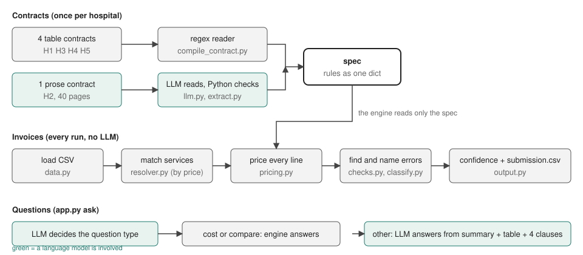
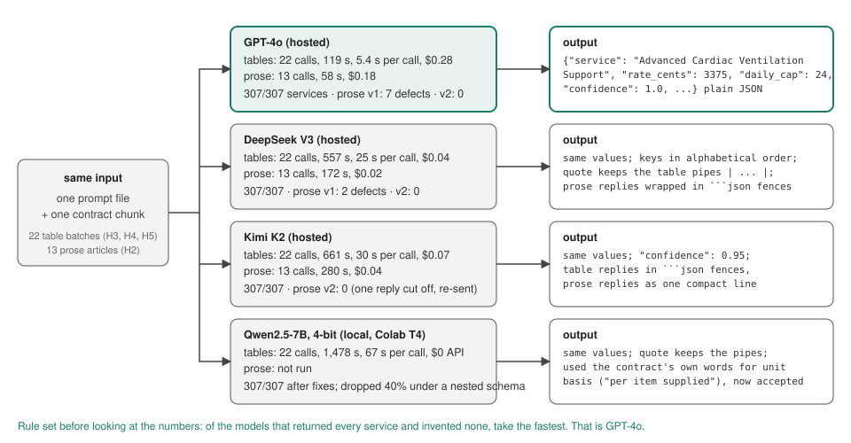

# invoice-audit

Finds wrong hospital invoices by re-pricing every line under the hospital's own contract.

Five hospitals, five different contracts, 61,211 invoice lines. Hospital 1 comes with
labels. Hospitals 2 to 5 are the ones predicted in `submission.csv`.

## Quick start

```bash
git clone https://github.com/nxull9/invoice-audit
cd invoice-audit
python -m venv .venv && source .venv/bin/activate
pip install -r requirements.txt          # pinned; tested on Python 3.13

python app.py audit INV-H4-000105     # one invoice: billed, expected, what is wrong, how sure
python app.py evaluate                # hospital 1 against its labels
python app.py submit                  # writes submission.csv for hospitals 2 to 5
```

No API key is needed for any of this. The one contract that needs a language model was
read once and every model reply is saved in `runs/`, so the code replays it.

## How it works



1. **Read the contract into a spec.** A spec is one Python dict with every rule: rates,
   daily caps, premiums, weekend uplifts, volume discounts, bundles, exclusions,
   multipliers. Four contracts are tables, so I read them with regex. Hospital 2 is 40
   pages of prose, so a language model reads it one article at a time. Every service the
   model returns is checked: its name must appear in the text the model was given, the
   rate must be a positive integer, the unit basis must be one the contract uses.

2. **Match each invoice description to a service.** Descriptions look like
   `THER std HEP inf`. I do not match them by text. A contract can only produce a small
   set of unit prices, so a description's usual price tells you which service it is. Text
   similarity is only used to break the rare ties. Every description in all five hospitals
   is matched this way, with no model call.

3. **Price every line.** Same steps for every contract: bundle rate if the partner service
   was delivered the same day, then facility multiplier, then plan tier multiplier, then
   premium or weekend uplift, then volume discount. Round half up after each step, as
   the contracts say. All money is integer cents. Cumulative discounts depend on earlier
   invoices, so a hospital is priced in service date order, as a whole.

4. **Find and name errors.** Seven checks need no contract (line arithmetic, invoice
   totals, dates, reused invoice ids, contract number). For price differences, the engine
   also keeps what the rate would have been without the discount, without the premium,
   and so on. If the billed rate matches one of those, the error gets that name
   (`volume_discount_omitted`) instead of a generic "price mismatch".

5. **Confidence and output.** Confidence is built from three things: how strong the
   evidence type is, how sure the service match was, and whether the contract was read by
   regex or by a model. Arithmetic findings keep their certainty through the last two,
   because neither was involved in finding them. No flag is reported as certain: the
   ceiling is 0.98, and the two categories that rest on a convention I fitted to a
   handful of labelled examples are capped at 0.90. Then one row per invoice in the
   template format, validated before it is written.

The language model is used in two places only: reading hospital 2's contract, and the
`ask` command where you type a question about a contract. It never sees an invoice and
never produces a total.

## Results

Hospital 1 (the labelled one):

- precision 1.000, recall 1.000 across all 18 error categories
- 909 of 913 expected totals exact
- 99.51% of line items reproduce the billed amount to the cent

All five hospitals: 99.30% to 99.49% of line items reproduce the billed amount, and
6.8% to 7.5% of invoices are flagged. Hospital 1's true rate is 6.4%.

I do not lead with the perfect score. The system recomputes rather than predicts, so if
the contract was read correctly, exact agreement is what you get. The numbers I trust
are the 99.5% line reproduction and the fault injection test: I put 96 errors into
invoices the labels call clean, and the system caught all 96 with no false positives.

Because services are matched to descriptions by price, I tested whether that
reproduction rate is circular rather than earned (`evaluation/resolution_holdout.py`).
On 13,608 lines across the five hospitals the expected unit price is not the modal price
that chose the service, because a bundle, a facility or tier multiplier, a premium, a
weekend uplift or a volume discount moved the rate; those reproduce at 98.6% to 99.6%. Fitting the matching on half the invoices and measuring on
the other half gives 99.35% to 99.64%. Matching by text alone instead of price drops it
to 93.5% to 96.2%, which is the control that matters: the number is not fixed at 99% by
the method.

Hospital 2 is the one contract a model read, and the model got it wrong the first
time: it filed three threshold premiums as daily caps. I found that from the numbers
(hospital 2 was at 97.8% reproduction and 25% flagged while the others were at 99.4% and
7%), then confirmed it by checking every extracted rule against the contract text. A
second prompt version fixed it on all three models I tried. Details are in
`reports/evaluation.md` and `prompts/CHANGELOG.md`.

## Choosing the model

I did not pick a model up front. I gave four the same job and measured them. The job was
the table exam: the same prompt and the same 22 table batches from hospitals 3, 4 and 5,
scored against the regex specs, so every answer had a known right value. Three of them
then read the same 13 prose articles from hospital 2.



| model | where it runs | services found | seconds per call | cost for the exam | prose defects (v1 → v2) |
|---|---|---:|---:|---:|---|
| GPT-4o | hosted | 307/307 | 5.4 | $0.28 | 7 → 0 |
| DeepSeek V3 | hosted | 307/307 | 25.3 | $0.04 | 2 → 0 |
| Kimi K2 | hosted | 307/307 | 30.0 | $0.07 | not run → 0 |
| Qwen2.5-7B 4-bit | local, Colab T4 | 307/307 | 67.2 | $0 API | not run |

Costs use OpenRouter's list prices at the time (about $2.50 / $10 per million tokens in
and out for GPT-4o, $0.27 / $1.10 for DeepSeek, $0.57 / $2.30 for Kimi). The whole
exam cost less than a dollar across all three hosted models.

What the same input produced. For the first row of hospital 5's rate table, all four
models returned the same service, rate, cap and unit basis. The differences were in
form, not content: Kimi wrapped its reply in a code fence, DeepSeek ordered the keys
alphabetically and kept the table's pipe characters in its quote, Qwen wrote the unit
basis the way the contract does ("per item supplied") instead of the way the invoices do
(`per_item`). Two of those broke my first harness, not the models. `parse_json` now
strips fences and `canonical_basis` accepts the contract's wording. That was a lesson
in itself: an extraction test can end up measuring its own schema.

On prose the models did differ. Under the first prompt GPT-4o filed three threshold
premiums as daily caps (7 defects) and DeepSeek invented two caps. The table exam had
not predicted that; reading a table and reading a clause are different jobs. Prompt v2
took all three hosted models to zero defects. Qwen ran only on the exam: it matched the
others once the harness bugs were fixed, but at 25 times GPT-4o's latency on a T4, and
under a nested output schema it had dropped 40% of rows, which is why the prose schema
is flat.

The decision rule was written down before the numbers came in: of the models that
return every service and invent none, take the fastest. That is GPT-4o. DeepSeek is
seven times cheaper and would be the pick if cost mattered more than speed; the client
switches with one line in `config.py`, and every model's replies are in `runs/`.

## Asking the contract a question

```bash
echo OPENROUTER_API_KEY=sk-or-... > .env       # only needed for ask
python app.py ask hospital_2 "which services have a daily cap, and which has the highest?"
python app.py ask h4 "what would 25 units of hepatic infusion therapy cost in one day?"
```

The model first says what kind of question it is. If it asks for a cost or a
comparison, Python computes the answer. Anything else the model answers from a summary
Python computed (counts, lists, extremes), the rules table, and the four most relevant
clauses from that hospital only. Off-topic questions get a one-sentence refusal. I tested
this with 274 generated questions with known answers; the final version got 137 of 137.
See `reports/qa_evaluation.md`.

## Project layout

```
app.py                 the commands: audit, ask, price, contract, extract, evaluate, submit
src/
  audit.py             runs one hospital; picks regex or model for the contract
  compile_contract.py  regex readers for the four table contracts
  extract.py, llm.py   model reads the prose contract; replies are checked and saved
  resolver.py          description to service, by price
  pricing.py           the engine
  checks.py            checks that need no contract
  classify.py          names the error
  output.py            confidence, explanation, submission.csv
  ask.py, retrieval.py contract questions
  ingest.py            PDF and OCR routes for contracts that do not arrive as text
prompts/               every prompt, versioned, with a changelog of why each changed
runs/                  every model reply, so nothing has to be re-run
evaluation/            fault injection, model comparison, the hospital 2 checker, baseline
tests/                 37 tests
reports/               evaluation.md, decision_log.md (+ appendix), qa_evaluation.md, writeup.md
data/                  contracts, invoices, hospital 1 labels, submission template
```

## Limitations

- Four decisions were calibrated on hospital 1's labels with very few examples (which
  invoice of a reused id is the wrong one: 5 examples; out-of-window date precedence:
  2). If hospitals 2 to 5 differ, nothing in the output would show it.
- The daily cap category: the contract caps the quantity, but the labels imply a smaller
  original quantity the contract does not state. I trim to the cap and give this
  category the lowest confidence. The four expected total misses are all this.
- Confidence is an ordering, not a probability. There is nothing to calibrate it against
  beyond hospital 1, where every prediction is right. No flagged invoice is reported
  above 0.98, and the two convention-fitted categories are capped at 0.90.
- No blind manual re-read of a sample of high-confidence flags and low-confidence clean
  invoices. That is the cheapest remaining check and it needs a person, not code.
- The hospital 2 checker is regex over one contract's wording. It proves this contract
  was read correctly. A sixth prose contract would need the model checked another way,
  most likely the line reproduction rate.
- The Q&A prompt was tuned on GPT-4o only.

## Tools

The ideas and the architecture in this project are mine. I worked through them in
discussion with Claude (Anthropic), which I used under my direction to write and review
code, run the evaluations and draft the documents. I reviewed every change before it
went in. Development and the model runs were done in Google Colab and on my own
machine. The prompts sent to the models, every raw reply, and the reasons behind each
decision are in the repository.

The models under evaluation (GPT-4o, DeepSeek, Kimi K2, Qwen2.5-7B) do one thing in
the system: read hospital 2's contract into a spec. No model computes money or decides
whether an invoice is wrong.
